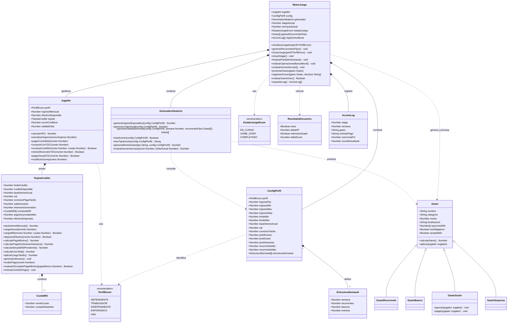

 # 🎮 FinaMente — Informe General de Gameplay v3

---

## 1. Arquitectura y Flujo de Datos

FinaMente es un simulador financiero gamificado de **6 etapas (meses)**.

### Interacción Front/Back

- El motor en **Vanilla JS** precalcula el stage completo y exporta un **JSON**.
- El frontend (**React + Three.js**) lee este JSON para generar oleadas de **"enemigos" (gastos)** en el mapa.
- El frontend **no maneja lógica financiera**, solo visualización.

### Separación de responsabilidades

| Capa | Responsabilidad |
|---|---|
| `MotorJuego` (Vanilla JS) | Lógica financiera, generación probabilística, estado del juego |
| `GeneradorAleatorio` | Toda la aleatoriedad: ingresos, límites, oleadas, montos, aumentos de línea |
| `ConfigPerfil` | Datos estáticos por perfil: rangos, tasas, probabilidades, estructura semanal |
| React + Three.js | Consumo del JSON exportado, visualización, animaciones |

### Auditoría IA

- Las decisiones del jugador se guardan en un `AccionLog[]`.
- Al finalizar el **stage 6:**
  - El historial se envía vía **Spring Boot**.
  - Se almacena en **MongoDB** de forma anónima.
  - Se envía a **OpenAI** para generar retroalimentación personalizada.

---

## 2. Inicialización del Juego

Al seleccionar perfil, `MotorJuego.inicializarJugador(perfil)` ejecuta:

1. Carga la `ConfigPerfil` correspondiente al perfil elegido.
2. Llama a `GeneradorAleatorio.generarLimiteInicial(config)` para asignar la línea de crédito inicial dentro del rango del perfil.
3. Construye la `TarjetaCredito` con los atributos del perfil (tasa, CAT, comisión).
4. Construye el `Jugador` con ingreso base, efectivo disponible = ingreso base, score = 0 y tarjeta asignada.

### Valores iniciales por perfil

| Perfil | Ingreso mensual | Límite de crédito | Tasa anual | CAT | Comisión tardío |
|---|---|---|---|---|---|
| Estudiante Dependiente | $2,000 | $500 – $1,000 | 98.5% | 158.3% | $250 + IVA |
| Estudiante Esporádico | $1,000 (stage 1) | $500 – $2,000 | 122.0% | 148.5% | $300 + IVA |
| Estudiante que Trabaja | $5,000 – $7,000 | $4,000 – $10,000 | 76.9% | 136.0% | $300 + IVA |
| Joven Independiente | $9,600 | $6,000 – $16,000 | 55.0% | 75.0% | $400 + IVA |

> El límite de crédito inicial se genera de forma aleatoria dentro del rango indicado mediante `GeneradorAleatorio.generarLimiteInicial()`.

---

## 3. Atributos del Jugador

### HP (Viabilidad Financiera)

```
HP = ingresoMensual − tarjeta.calcularPagoMinimo()
```

- Si **HP ≤ 0 → Game Over**: el jugador no puede cubrir ni el pago mínimo con su ingreso.
- Quedarse sin crédito disponible **no** produce Game Over — solo restringe al jugador a operar con débito.

### Score Crediticio

- Escala: **0 a 100**. Todos los perfiles inician en **0**.
- Se ajusta en dos momentos distintos del ciclo mensual (ver sección 6).

### Ingreso del perfil Esporádico

A partir del stage 2, al inicio de cada stage `MotorJuego.iniciarStage()` llama a:

```
GeneradorAleatorio.generarIngresoEsporadico(config)
→ valor aleatorio entre $500 y $2,000 en pasos de $250
```

El resultado se aplica mediante `Jugador.actualizarIngreso(nuevoIngreso)` antes de calcular HP.

---

## 4. Estructura de un Stage

Cada **stage (mes)** tiene **4 semanas**:

| Semana | Fase |
|---|---|
| 1 – 3 | Combate: aparición de oleadas de gastos |
| 4 | Combates restantes + **Fecha de Corte** |

Al inicio de las **semanas 1 y 2 del stage siguiente** se abre la **Ventana de Pago** (ver sección 6).

### Economía base

Entre el **75% y 90% del ingreso** se destina automáticamente a gastos Recurrentes y Básicos. El jugador administra el resto en Gustos y Sorpresas.

---

## 5. Sistema de Combate y Generación de Oleadas

### Tipos de gasto (enemigos)

| Tipo | Descripción | ¿Obligatorio? | ¿Acepta MSI? |
|---|---|---|---|
| Recurrente | Servicios fijos mensuales (renta, internet, suscripciones) | Sí | No |
| Básico | Necesidades del mes (despensa, transporte, medicamentos) | Sí | No |
| Gusto | Gastos no esenciales (ropa, salidas, entretenimiento) | No — puede ignorarse | Sí (si score ≥ 40) |
| Sorpresa | Imprevistos (médico, multa, reparación) | Sí | Sí (si score ≥ 40) |

> `GastoGusto` es el único tipo con método `ignorar()`. Los demás son siempre obligatorios.

### Densidad por perfil

La estructura semanal y las probabilidades de eventos se definen en `ConfigPerfil` mediante `EstructuraSemanal[]` y se resuelven con `GeneradorAleatorio.generarOleadaSemanal()`.

| Perfil | Recurrentes / stage | Prob. evento / semana | Distribución evento |
|---|---|---|---|
| Dependiente | 2 | 50% | 90% Gusto / 10% Sorpresa |
| Trabaja | 3 – 4 | 70% | 85% Gusto / 15% Sorpresa |
| Independiente | 2 | 85% | 75% Gusto / 25% Sorpresa |
| Esporádico | 2 | 60% | 80% Gusto / 20% Sorpresa |

### Estructura semanal por perfil

**Dependiente**

| Semana | Composición |
|---|---|
| S1 | 2R + 3B |
| S2 | 2B + 1E |
| S3 | 2B + 1E |
| S4 | 2B |

**Trabaja**

| Semana | Composición |
|---|---|
| S1 | Todos R + 3B |
| S2 | 3B + 1E |
| S3 | 2B + 1E |
| S4 | 3B + 1E |

**Independiente**

| Semana | Composición |
|---|---|
| S1 | 2R + 3B |
| S2 | 3B + 1E |
| S3 | 3B + 2E |
| S4 | 3B + 1E |

**Esporádico**

| Semana | Composición |
|---|---|
| S1 | 2R + 3B |
| S2 | 2B + 1E |
| S3 | 2B + 1E |
| S4 | 2B + 1E |

> **Leyenda:** R = Recurrente · B = Básico · E = Evento (Gusto o Sorpresa)

### Resolución de un slot de tipo E

```
1. tirarEvento(config)        → Boolean  ¿hay evento esta semana?
2. Si true → tirarTipoEvento(config) → "GUSTO" | "SORPRESA"
3. generarMontoGasto(tipo, config)   → monto dentro del rango del catálogo
4. Construir instancia GastoGusto o GastoSorpresa
```

---

## 6. Decisión de Pago

Ante cada gasto, el jugador elige uno de cuatro métodos:

| Método | Efecto inmediato | Consecuencia futura |
|---|---|---|
| Débito / efectivo | Reduce `efectivoDisponible` | Sin deuda ni intereses |
| TDC normal | Reduce `creditoDisponible`, suma a `saldoInsoluto` | Genera intereses si no se paga en corte |
| MSI | Divide en cuotas, bloquea parte del límite | Sin interés si se paga puntualmente |
| Ignorar (solo Gusto) | Sin efecto financiero | Sin consecuencia directa |

### Elegibilidad de MSI

- `scoreCrediticio ≥ 40`
- `Gasto.aceptaMSI === true`
- Validación en `Jugador.comprarConMSI()` — no en el gasto

---

## 7. Historial Crediticio y Ventana de Pago

El **Score Crediticio (0–100)** se ajusta en dos momentos del ciclo:

### A. Uso de la línea (Fecha de Corte — semana 4)

| Uso del crédito | Impacto en score |
|---|---|
| < 60% | +5 pts |
| 60% – 89% | 0 pts |
| ≥ 90% | −5 pts |

### B. Velocidad de pago (Ventana de Pago)

La ventana es válida durante las **semanas 1 y 2 del stage siguiente**, con límite justo antes del **último gasto de la semana 2**. En el **stage 6**, el cobro es inmediato (`VentanaPagoEnum.INMEDIATA`).

`MotorJuego.avanzarVentana()` transiciona el estado:
```
ABIERTA → EXPIRADA   al llegar al último gasto de semana 2
ABIERTA → INMEDIATA  en stage 6
```

| Acción | Impacto en score | Efecto financiero |
|---|---|---|
| Pago total — semana 1 | +10 pts | Elimina saldo e intereses |
| Pago total — semana 2 | +5 pts | Elimina saldo e intereses |
| Pago mínimo — semana 1 o 2 | 0 pts | Intereses activos sobre saldo restante |
| No pago (ventana expirada) | −20 pts | Cargo tardío + intereses moratorios |

### Cargo por pago tardío

```
Cargo = comisionPagoTardio × 1.16   (comisión + IVA)
```

El cargo reduce `creditoDisponible` y suma al `saldoInsoluto`.

---

## 8. Fórmulas Financieras

### Tasa de interés mensual (derivada)

```
tasaInteresMensual = (1 + tasaInteresAnual)^(1/12) − 1
```

No se almacena como atributo — se calcula en cada llamada a `TarjetaCredito.tasaInteresMensual()`.

### Pago mínimo (normativa Banxico)

```
Opción 1 = (1.5% × saldoInsoluto) + interesesGenerados + (interesesGenerados × 0.16)
Opción 2 = 1.25% × limiteCredito
Pago Mínimo = max(Opción 1, Opción 2) + Σ cuotasMSI del mes
```

### IVA

El IVA (16%) aplica sobre **intereses** y **comisiones**, nunca sobre capital.

---

## 9. Progresión: Aumentos de Línea de Crédito

Después de cada pago exitoso, `MotorJuego.evaluarPago()` delega en:

```
GeneradorAleatorio.evaluarAumentoLinea(score, limiteActual)
→ null          si no aplica según probabilidad
→ nuevoLimite   si aplica: limiteActual × (1 + delta)
                donde delta ∈ [0.20, 0.40] aleatorio
```

| Score | Probabilidad de aumento |
|---|---|
| 0 – 30 | 0% |
| 31 – 50 | 15% |
| 51 – 75 | 40% |
| 76 – 100 | 70% |

---

## 10. Condición de Game Over

```
evaluarGameOver():
  HP = jugador.ingresoMensual − jugador.tarjeta.calcularPagoMinimo()
  Si HP ≤ 0 → estadoJuego = GAME_OVER
```

El juego también concluye exitosamente al finalizar el stage 6 → `estadoJuego = COMPLETADO`.

---

## 11. Cierre de Partida y Auditoría

Al llegar a `GAME_OVER` o `COMPLETADO`:

1. `MotorJuego.exportarLog()` serializa `registroAuditoria: AccionLog[]`.
2. El frontend envía el JSON al backend (Spring Boot).
3. Spring Boot persiste el registro en MongoDB (anónimo, sin datos personales).
4. Spring Boot construye el prompt con el historial y consulta la API de OpenAI.
5. El feedback educativo personalizado regresa al frontend para mostrarse al jugador.

### Estructura de `AccionLog`

| Campo | Descripción |
|---|---|
| `stage` | Número de etapa (1–6) |
| `semana` | Semana dentro del stage (1–4) |
| `gasto` | Nombre del gasto enfrentado |
| `metodoPago` | DÉBITO, TDC, MSI, IGNORADO |
| `usoLineaPct` | % de uso de crédito en ese momento |
| `scoreResultante` | Score después de la acción |

---

## 12. Pendientes por Definir (Actualizado)

| Pendiente | Descripción |
|---|---|
| Feedback IA | Configuración de prompts específicos para la retroalimentación de MSI y Gasto Hormiga |


