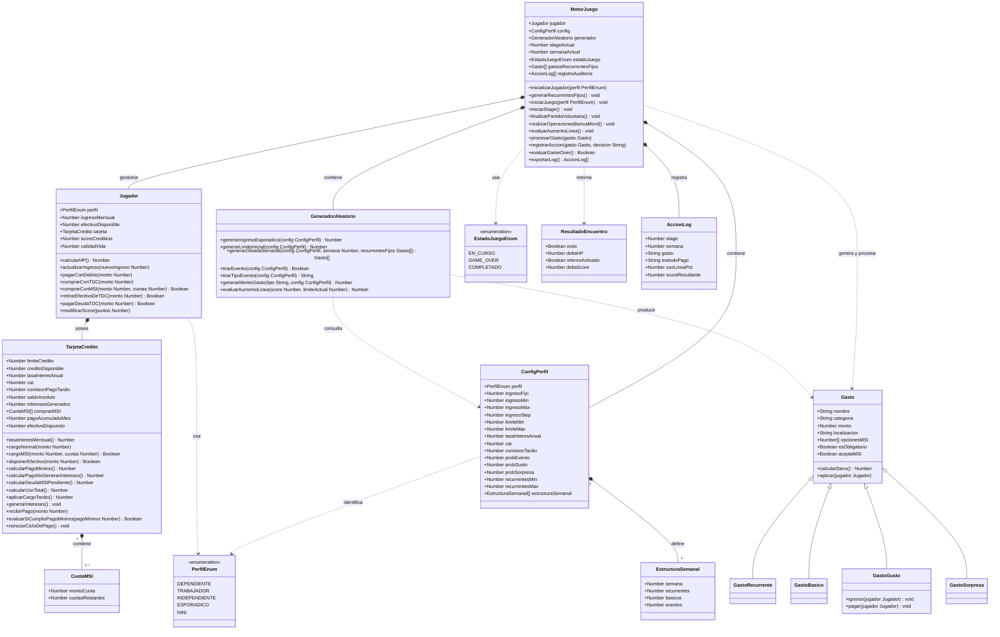

---

# 🎮 FinaMente — Informe General de Gameplay v4

---

# 1. Arquitectura General del Sistema

FinaMente es un simulador financiero gamificado de **6 etapas (meses)** que modela decisiones financieras reales bajo presión económica y temporal.

El objetivo del sistema es enseñar:

* Planeación financiera
* Uso responsable del crédito
* Manejo de liquidez
* Balance entre bienestar y solvencia

---

## Interacción Front / Back (lógico)

El sistema se divide en dos dominios bien separados:

### Backend lógico — Motor del juego

Implementado en:

```text
Vanilla JavaScript
```

Responsable de:

* Generación financiera
* Cálculos matemáticos
* Estados del juego
* Persistencia lógica
* Generación probabilística

Salida:

```text
JSON precalculado por Stage
```

---

### Frontend visual

Implementado en:

```text
React + Three.js
```

Responsable de:

* Renderizar mapa
* Mostrar gastos como enemigos
* Mostrar HUD financiero
* Animaciones
* Interacciones visuales

El frontend:

```text
NO contiene lógica financiera
```

Solo visualización.

---

## Separación de Responsabilidades

| Capa                 | Responsabilidad          |
| -------------------- | ------------------------ |
| `MotorJuego`         | Lógica financiera global |
| `GeneradorAleatorio` | Aleatoriedad financiera  |
| `ConfigPerfil`       | Configuración estática   |
| `TarjetaCredito`     | Cálculos financieros     |
| `Jugador`            | Estado económico         |
| React + Three.js     | Visualización            |

---

# 2. Inicialización del Juego

Al seleccionar un perfil:

```text
MotorJuego.inicializarJugador(perfil)
```

Se ejecutan:

1. Cargar `ConfigPerfil`
2. Generar límite inicial
3. Crear tarjeta
4. Crear jugador
5. Generar recurrentes fijos
6. Inicializar métricas narrativas

---

## Valores iniciales por perfil

| Perfil        | Ingreso mensual | Límite crédito | Tasa anual | CAT    |
| ------------- | --------------- | -------------- | ---------- | ------ |
| Dependiente   | $2,000          | $500–$1,000    | 98.5%      | 158.3% |
| Esporádico    | $1,000          | $500–$2,000    | 122%       | 148.5% |
| Trabajador    | $5,000–$7,000   | $4,000–$10,000 | 76.9%      | 136%   |
| Independiente | $9,600          | $6,000–$16,000 | 55%        | 75%    |
| **NINI**      | $500–$2,000     | $500–$1,500    | Alta       | Alta   |

---

# 3. Atributos del Jugador

```javascript
Jugador {
 ingresoMensual
 efectivoDisponible
 tarjeta
 scoreCrediticio
 calidadVida
}
```

---

## HP — Viabilidad financiera

```text
HP = ingresoMensual − pagoMinimo
```

Si:

```text
HP ≤ 0 → GAME OVER
```

---

## Calidad de Vida (CV)

Nuevo indicador narrativo.

```text
Escala: 0 – 100
Inicial: 50
```

### Reglas:

| Evento        | Cambio CV           |
| ------------- | ------------------- |
| Pagar gusto   | + floor(monto / 75) |
| Ignorar gusto | − floor(monto / 75) |
| Game Over     | CV se congela       |

Importante:

```text
CV NO afecta Score
CV NO afecta deuda
CV solo narrativa
```

---

# 4. Sistema de Localizaciones

Cada gasto aparece en una localización del mapa.

---

## Enum de Localizaciones

```text
ESCUELA
TRANSPORTE
CONSULTORIO
CENTRO_COMERCIAL
RECAMARA
SUPERMERCADO
CASA_OFICINA
```

---

## Costos dinámicos por localización

Cada gasto define:

```javascript
localizaciones: {
 Supermercado: { modMonto: 1.0 },
 CasaOficina:  { modMonto: 1.15 }
}
```

Monto real:

```text
montoFinal = montoBase × modMonto
```

Esto simula:

* recargos
* delivery
* precios urbanos

---

# 5. Estructura de Stage

Cada stage = 1 mes.

Cada mes tiene:

```text
4 semanas
```

---

## Distribución semanal

| Semana | Tipo                  |
| ------ | --------------------- |
| 1      | Recurrentes + básicos |
| 2      | Básicos + eventos     |
| 3      | Básicos + eventos     |
| 4      | Cierre + corte        |

---

# 6. Recurrentes Fijos

Nuevo comportamiento.

---

## Generación

Solo en:

```text
Mes 1
```

Después:

```text
Se congelan hasta Mes 6
```

---

## Reglas

* Aparecen siempre en:

```text
Semana 1
```

* Localización:

```text
RECAMARA
```

Esto permite:

```text
Planeación financiera real
```

---

# 7. Tipos de Gastos

| Tipo       | Obligatorio | MSI      |
| ---------- | ----------- | -------- |
| Recurrente | Sí          | No       |
| Básico     | Sí          | Limitado |
| Gusto      | No          | Sí       |
| Sorpresa   | Sí          | Sí       |

---

# 8. Sistema MSI v2

Sistema completamente rediseñado.

---

## Reglas nuevas

MSI disponible si:

```text
Hay crédito suficiente
```

(No depende de score)

---

## Bloqueo de crédito

```text
creditoDisponible -= montoTotal
```

---

## Impacto mensual

Cada mes:

```text
cuotaMSI → se suma al pago mínimo
```

Esto reduce:

```text
HP automáticamente
```

---

## Liberación de crédito

Se libera:

```text
proporcionalmente por cuota pagada
```

---

# 9. Disposición de Efectivo desde TDC

Permite obtener liquidez inmediata.

---

## Límites por perfil

| Perfil        | Retiro máximo | Comisión |
| ------------- | ------------- | -------- |
| Dependiente   | 30%           | 9%       |
| Trabajador    | 50%           | 8%       |
| Independiente | 70%           | 7%       |
| Esporádico    | 40%           | 9%       |
| NINI          | 30%           | 9%       |

---

## Costo real

```text
Comisión = monto × porcentaje
IVA = comisión × 0.16
CostoTotal = comisión + IVA
```

IVA:

```text
NO aplica sobre capital
```

---

# 10. Indicador: Pago para No Generar Intereses

Nueva métrica clave.

---

## Cálculo

```text
PagoNoIntereses =
 saldoInsoluto
 + intereses
 + IVA
```

Si se paga:

```text
No se generan intereses el mes siguiente
```

---

# 11. Sistema de Score Crediticio

Escala:

```text
0 – 100
```

---

## Impacto por uso

| Uso    | Score |
| ------ | ----- |
| < 60%  | +5    |
| 60–89% | 0     |
| ≥ 90%  | −5    |

---

## Impacto por pago

| Acción              | Score |
| ------------------- | ----- |
| Pago total semana 1 | +10   |
| Pago total semana 2 | +5    |
| Pago mínimo         | 0     |
| No pago             | −20   |

---

# 12. Sistema de Liquidez

Nueva capa económica crítica.

---

## Flujo de liquidez

Jugador puede:

* Usar efectivo
* Usar TDC
* Retirar efectivo

Pero:

```text
Efectivo limitado
Crédito limitado
Retiro limitado
```

Esto crea presión realista.

---

# 13. Condiciones de Game Over

Ahora existen **dos rutas**.

---

## Game Over Financiero

```text
HP ≤ 0
```

Jugador no puede pagar mínimo.

---

## Game Over por Crisis de Liquidez

Se activa si:

1. Gasto requiere efectivo
2. No hay efectivo suficiente
3. No puede retirar efectivo

Esto simula:

```text
Insolvencia inmediata
```

---

# 14. Economía Base del Juego

Balance financiero general.

---

## Distribución económica

```text
75–80% ingreso → gastos obligatorios
20–25% ingreso → estrategia
```

Esto fuerza:

```text
Toma de decisiones reales
```

---

# 15. Navegación Global

Nuevo sistema UX.

---

## Banca móvil ubicua

Disponible:

```text
Desde cualquier localización
```

Acceso:

```text
Tecla: p
```

Permite:

* pagar deuda
* retirar efectivo
* revisar estado

---

## Salida voluntaria

```text
Tecla: x
```

Permite terminar partida.

Excepto:

```text
Durante combate activo
```

---

# 16. Perfil NINI

Nuevo perfil económico.

---

## Características

```text
Ingreso: $500–$2,000
Alta variabilidad
Crédito fácil
Alto riesgo financiero
```

---

## Restricciones

No genera gastos en:

```text
ESCUELA
```

---

# 17. Auditoría Inteligente

Todas las acciones del jugador se registran.

---

## Registro

```javascript
AccionLog {
 stage
 semana
 gasto
 metodoPago
 score
}
```

---

## Flujo final

Al terminar:

1. Exportar log
2. Enviar backend
3. Guardar MongoDB
4. Analizar IA
5. Generar feedback

---

# 18. Modelo Conceptual del Gasto

Nuevo modelo modular.

---

```javascript
{
 nombre,
 categoria,
 monto,
 esObligatorio,
 aceptaMSI,

 localizaciones: {
   SUPERMERCADO: { modMonto: 1.0 },
   CASA_OFICINA: { modMonto: 1.15 }
 }
}
```

Esto permite:

```text
Costos dinámicos
Escalabilidad
Extensión futura
```

---

# 19. Curva de Aprendizaje

Sistema educativo progresivo.

---

## Stage 1

* Sin multas
* Sin castigos severos

---

## Stage 2+

Se activan:

```text
Recordatorios de pago
Consecuencias reales
```

---

# 20. Estado Final del Juego

El juego termina cuando:

```text
Stage 6 completado
```

O:

```text
Game Over
```

---

# Resultado

Este documento **v4** ya contiene:

* Todas las mecánicas nuevas integradas
* Reglas actualizadas
* Arquitectura coherente
* Flujo financiero realista
* Base sólida para implementación futura

---



