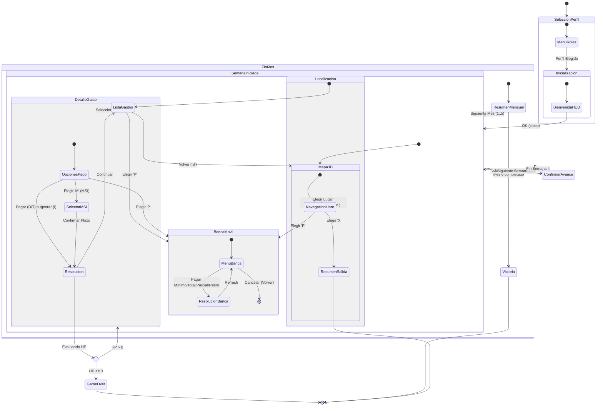

# Diagrama de Flujo de la Interfaz (State Machine)

Este diagrama representa cómo el motor de juego transiciona entre los diferentes estados de la interfaz de usuario. Es fundamental para el equipo de Frontend, ya que define la navegación y las condiciones de espera.

### Consideraciones para React + Three.js:

1.  **Estado "Detenido"**: El motor de juego se detiene (usando `await`) cada vez que entra en un estado que requiere entrada del usuario (`Mapa3D`, `ListaGastos`, `DetalleGasto`, `BancaMovil`).
2.  **Transiciones**: Cuando el usuario hace clic en un elemento de Three.js (ej. un edificio en el mapa), la interfaz debe resolver la promesa pendiente del motor para que este avance al siguiente estado (`Localizacion`).
3.  **Superposición (Overlays)**: Los estados `BancaMovil` y `DetalleGasto` pueden ser "modales" que se enciman a la vista actual sin destruirla.
4.  **Game Over**: El estado de `GameOver` puede ocurrir en casi cualquier momento después de una resolución de gasto o un cierre de mes.
