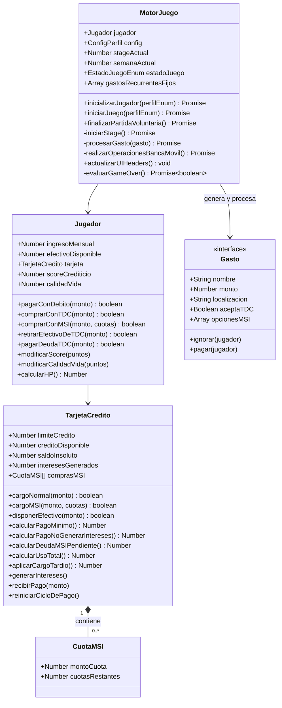
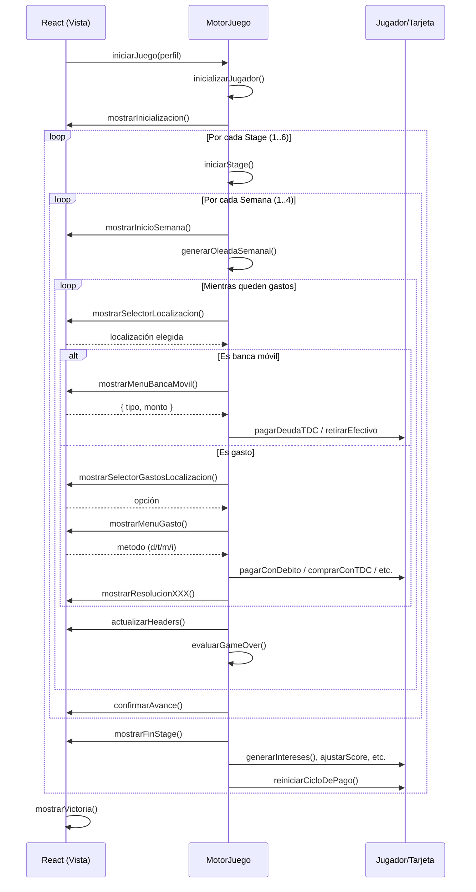

# Documento Técnico para el Equipo de Frontend (React + Three.js)

## Integración del Motor de Juego (Vanilla JS) con la Interfaz Visual

---

### 1. Arquitectura General

El sistema se divide en dos capas completamente desacopladas:

| Capa | Tecnología | Responsabilidad |
|------|------------|-----------------|
| **Motor Lógico** | JavaScript (ES6 modules) | Reglas financieras, simulación de 6 meses, generación de gastos, cálculos de intereses, gestión de estado del jugador, determinación de Game Over. |
| **Capa de Presentación** | React + Three.js | Renderizado del mapa, visualización de gastos como "enemigos", HUD financiero, animaciones, captura de decisiones del usuario, comunicación con el motor. |

**Principio clave:** El motor **no conoce** el DOM, React ni Three.js. Solo recibe un objeto `vista` que implementa una interfaz específica (métodos asíncronos que devuelven decisiones del usuario). Esto permite cambiar la interfaz gráfica sin modificar una sola línea del motor.

---

### 2. Diagrama de Clases del Motor (Simplificado)

Basado en el diagrama del `InformeGameplayV4.md`, estas son las clases que React **no necesita conocer internamente**, pero cuyos métodos públicos son invocados a través de `MotorJuego`.



---

### 3. La Interfaz `Vista` que React Debe Implementar

El motor `MotorJuego` recibe en su constructor un objeto `vista`. Este objeto debe implementar **obligatoriamente** los siguientes métodos (todos asíncronos o que devuelvan `Promise`). React usará `useState`, `useEffect` y componentes para satisfacer estas firmas.

#### Tabla de métodos requeridos

| Método | Parámetros | Retorno | Uso |
|--------|------------|---------|-----|
| `mostrarInicializacion(perfilEnum, ingresoInicial, limiteInicial, tasaInteresAnual)` | (string, number, number, number) | `void` | Muestra un mensaje de bienvenida con los datos del perfil. |
| `actualizarHeaders(estado)` | `{ hp, saldoInsoluto, limiteCredito, efectivoDisponible, calidadVida, stageActual, semanaActual }` | `void` | Actualiza el HUD superior (barras, valores). |
| `mostrarSelectorLocalizacion(localizaciones)` | `Array<string>` | `Promise<string>` → localización elegida o `'p'` (banca móvil) o `'x'` (salir) | Renderiza un mapa interactivo y devuelve la selección. |
| `mostrarSelectorGastosLocalizacion(localizacion, gastos)` | `(string, Array<Gasto>)` | `Promise<string>` → índice (1..n), `'p'`, `'s'` (salir de la loc), `'x'` | Muestra la lista de gastos disponibles en una localización. |
| `mostrarMenuGasto(gasto, estadoVirtual, puedeIgnorar, tieneDeuda)` | `(Gasto, { efectivoDisponible, creditoDisponible }, boolean, boolean)` | `Promise<string>` → `'d'`, `'t'`, `'m'`, `'i'`, `'s'`, `null` (game over) | Presenta las opciones de pago para un gasto. |
| `mostrarMenuBancaMovil(estadoBanca)` | `{ limiteCredito, creditoDisponible, saldoInsoluto, pagoMinimo, pagoNoIntereses, efectivoDisponible, maxRetiro, comisionPct }` | `Promise<{ tipo: 'MINIMO'\|'TOTAL'\|'PARCIAL'\|'RETIRO'\|'CANCELAR', monto?: number }>` | Interfaz para pagar o retirar efectivo. |
| `mostrarSelectorMSI(opcionesCuotas)` | `Array<number>` (ej. `[1,3,6]`) | `Promise<number>` | Permite elegir el número de meses sin intereses. |
| `mostrarMenuDisposicionObligatoria(gasto, maxRetiro, comisionPct)` | `(Gasto, number, number)` | `Promise<{ monto: number } \| null>` | Cuando un gasto solo acepta efectivo y no hay suficiente, pregunta si retirar. |
| `mostrarNotificacionVentanaPagoInmediata()` | ninguno | `void` | Aviso especial en el Stage 6 para indicar que se debe liquidar la cuenta. |
| `confirmarAvance()` | ninguno | `Promise<'salir' \| ''>` | Al final de cada semana pregunta si continuar o salir. |
| `mostrarResolucionGastoDebito()`, `mostrarResolucionGastoCredito()`, `mostrarResolucionGastoMSI(cuotas)`, `mostrarResolucionGastoIgnorado()`, `mostrarResolucionPagoMinimo()`, `mostrarResolucionPagoTotal()`, `mostrarResolucionPagoParcial(monto)`, `mostrarResolucionExpiracion(cargo)`, `mostrarAumentoLinea(limiteViejo, limiteNuevo)`, `mostrarCambioScore(mensaje, tipo, nuevoScore)`, `mostrarAdvertenciaUltimoDia()`, `mostrarGameOverPorHP(stage, stats)`, `mostrarGameOverInsolvencia(stage, stats)`, `mostrarGameOverInsolvenciaExtrema(gasto, stage, stats)`, `mostrarVictoria(hp, score)`, `mostrarResumenSalidaVoluntaria(stage, stats)`, `mostrarFinStage(stage, stats, esPerfilVistoso)` | según corresponda | `void` | Notificaciones, diálogos y pantallas de estado. |
| `sleep(ms)` | `number` | `Promise<void>` | Pausa la ejecución del motor mientras la UI muestra animaciones. |

> **Nota:** El motor ya implementa `sleep` llamando a `vista.sleep(ms)`. React puede implementarlo simplemente como `new Promise(resolve => setTimeout(resolve, ms))`.

---

### 4. Flujo de Ejecución Típico (Ciclo de Juego)

El frontend inicia la partida así:

```jsx
import { MotorJuego } from './motor/MotorJuego';
import { PerfilEnum } from './motor/Enums';

// 1. Crear el objeto vista (implementado con React)
const vistaReact = {
  async mostrarSelectorLocalizacion(locs) { /* mostrar mapa y esperar click */ },
  async mostrarMenuGasto(...) { /* mostrar modal y esperar */ },
  // ... todos los métodos
};

// 2. Instanciar el motor
const motor = new MotorJuego(vistaReact);

// 3. Iniciar juego con el perfil seleccionado
await motor.iniciarJuego(PerfilEnum.TRABAJADOR);
```

El motor, internamente, ejecuta este flujo:



---

### 5. Implementación de la Vista en React (Ejemplo Práctico)

A continuación, se muestra un esqueleto de cómo implementar los métodos críticos usando React hooks y Three.js.

#### 5.1. Componente Principal `App.jsx`

```jsx
import React, { useState, useEffect, useRef } from 'react';
import { MotorJuego } from './motor/MotorJuego';
import { PerfilEnum } from './motor/Enums';
import { HUD } from './components/HUD';
import { Mapa3D } from './components/Mapa3D';
import { ModalBancaMovil } from './components/ModalBancaMovil';
import { ModalGasto } from './components/ModalGasto';
import { ModalSelectorLocalizacion } from './components/ModalSelectorLocalizacion';

function App() {
  const [estadoHUD, setEstadoHUD] = useState({
    hp: 0,
    saldoInsoluto: 0,
    limiteCredito: 0,
    efectivoDisponible: 0,
    calidadVida: 50,
    stageActual: 1,
    semanaActual: 1,
  });
  const [dialogo, setDialogo] = useState(null); // { tipo, props, resolver }
  const motorRef = useRef(null);

  // Función genérica para mostrar un modal y esperar una respuesta
  const mostrarModal = (tipo, props) => {
    return new Promise((resolve) => {
      setDialogo({ tipo, props, resolver: resolve });
    });
  };

  // Implementación de la interfaz Vista
  const vista = {
    actualizarHeaders: (estado) => setEstadoHUD(estado),
    
    async mostrarSelectorLocalizacion(localizaciones) {
      return mostrarModal('selectorLocalizacion', { localizaciones });
    },
    
    async mostrarSelectorGastosLocalizacion(localizacion, gastos) {
      return mostrarModal('selectorGastos', { localizacion, gastos });
    },
    
    async mostrarMenuGasto(gasto, estadoVirtual, puedeIgnorar, tieneDeuda) {
      return mostrarModal('menuGasto', { gasto, estadoVirtual, puedeIgnorar, tieneDeuda });
    },
    
    async mostrarMenuBancaMovil(estadoBanca) {
      return mostrarModal('bancaMovil', { estadoBanca });
    },
    
    async mostrarSelectorMSI(opciones) {
      return mostrarModal('selectorMSI', { opciones });
    },
    
    async mostrarMenuDisposicionObligatoria(gasto, maxRetiro, comisionPct) {
      return mostrarModal('disposicionObligatoria', { gasto, maxRetiro, comisionPct });
    },
    
    async confirmarAvance() {
      return mostrarModal('confirmarAvance', {});
    },
    
    sleep: (ms) => new Promise(resolve => setTimeout(resolve, ms)),
    
    // Notificaciones simples (pueden ser toasts)
    mostrarResolucionGastoDebito: () => alert('Pagado con débito'),
    mostrarResolucionGastoCredito: () => alert('Pagado con crédito'),
    mostrarResolucionGastoMSI: (cuotas) => alert(`Pagado a ${cuotas} MSI`),
    mostrarResolucionGastoIgnorado: () => alert('Gasto ignorado'),
    mostrarResolucionPagoMinimo: () => alert('Pagaste el mínimo'),
    mostrarResolucionPagoTotal: () => alert('¡Pagaste total!'),
    mostrarResolucionPagoParcial: (monto) => alert(`Abonaste $${monto}`),
    mostrarResolucionExpiracion: (cargo) => alert(`Cargo tardío: $${cargo}`),
    mostrarAumentoLinea: (viejo, nuevo) => alert(`Límite aumentado: $${viejo} → $${nuevo}`),
    mostrarCambioScore: (msg, tipo, nuevo) => console.log(`Score: ${nuevo}`),
    mostrarAdvertenciaUltimoDia: () => alert('⚠️ Último día para pagar mínimo'),
    mostrarNotificacionVentanaPagoInmediata: () => alert('¡Atención! Stage 6: Recuento final.'),
    mostrarGameOverPorHP: (stage, stats) => alert(`Game Over por HP en mes ${stage}`),
    mostrarGameOverInsolvencia: (stage, stats) => alert(`Game Over por insolvencia en mes ${stage}`),
    mostrarGameOverInsolvenciaExtrema: (gasto, stage, stats) => alert(`Game Over: no puedes pagar ${gasto.nombre}`),
    mostrarVictoria: (hp, score) => alert(`Victoria! HP final: $${hp}, Score: ${score}`),
    mostrarResumenSalidaVoluntaria: (stage, stats) => alert(`Saliste en el mes ${stage}`),
    mostrarFinStage: (stage, stats, esVistoso) => console.log(`Fin del mes ${stage}`, stats),
    mostrarInicializacion: (perfil, ingreso, limite, tasa) => console.log(`Inicializado ${perfil}`),
    mostrarInicioSemana: (stage, semana) => console.log(`Semana ${semana} del mes ${stage}`),
  };

  // Iniciar el juego al montar el componente
  useEffect(() => {
    const iniciar = async () => {
      const motor = new MotorJuego(vista);
      motorRef.current = motor;
      // Suponiendo que el usuario eligió un perfil desde un menú previo
      await motor.iniciarJuego(PerfilEnum.TRABAJADOR);
    };
    iniciar();
  }, []);

  // Renderizar el modal activo según el diálogo
  const renderModal = () => {
    if (!dialogo) return null;
    const { tipo, props, resolver } = dialogo;
    switch (tipo) {
      case 'selectorLocalizacion':
        return <ModalSelectorLocalizacion localizaciones={props.localizaciones} onSelect={resolver} />;
      case 'selectorGastos':
        return <ModalSelectorGastos localizacion={props.localizacion} gastos={props.gastos} onSelect={resolver} />;
      case 'menuGasto':
        return <ModalGasto {...props} onSelect={resolver} />;
      case 'bancaMovil':
        return <ModalBancaMovil {...props} onSelect={resolver} />;
      case 'selectorMSI':
        return <ModalMSI opciones={props.opciones} onSelect={resolver} />;
      case 'disposicionObligatoria':
        return <ModalDisposicion {...props} onSelect={resolver} />;
      case 'confirmarAvance':
        return <ModalConfirmacion onSelect={resolver} />;
      default:
        return null;
    }
  };

  return (
    <div className="game-container">
      <HUD {...estadoHUD} />
      <Mapa3D motor={motorRef.current} /> {/* El mapa puede llamar a métodos del motor si es necesario */}
      {renderModal()}
    </div>
  );
}

export default App;
```

#### 5.2. Ejemplo de un Modal de Gasto (React)

```jsx
// ModalGasto.jsx
import React, { useState } from 'react';

export function ModalGasto({ gasto, estadoVirtual, puedeIgnorar, tieneDeuda, onSelect }) {
  const [metodo, setMetodo] = useState(null);
  
  const handleSelect = (opcion) => {
    onSelect(opcion); // Resuelve la promesa de la vista
  };

  return (
    <div className="modal-overlay">
      <div className="modal-gasto">
        <h3>{gasto.nombre}</h3>
        <p>Monto: ${gasto.monto.toFixed(2)}</p>
        <p>Efectivo disponible: ${estadoVirtual.efectivoDisponible.toFixed(2)}</p>
        <p>Crédito disponible: ${estadoVirtual.creditoDisponible.toFixed(2)}</p>
        <div className="botones">
          {estadoVirtual.efectivoDisponible >= gasto.monto && (
            <button onClick={() => handleSelect('d')}>💵 Pagar con débito</button>
          )}
          {estadoVirtual.creditoDisponible >= gasto.monto && (
            <button onClick={() => handleSelect('t')}>💳 Pagar con TDC</button>
          )}
          {gasto.aceptaMSI && estadoVirtual.creditoDisponible >= gasto.monto && (
            <button onClick={() => handleSelect('m')}>📆 MSI</button>
          )}
          {puedeIgnorar && (
            <button onClick={() => handleSelect('i')}>😞 Ignorar (baja CV)</button>
          )}
          <button onClick={() => handleSelect('s')}>↩️ Regresar</button>
        </div>
      </div>
    </div>
  );
}
```

---

### 6. Integración con Three.js

El motor no sabe nada de Three.js. Es responsabilidad de la vista:

- Renderizar un mapa 3D con localizaciones (escuela, supermercado, etc.).
- Representar cada `Gasto` como un objeto 3D (ej. un ícono flotante).
- Cuando el usuario hace clic en un objeto, llamar al método correspondiente del motor.

**Ejemplo de componente `Mapa3D`:**

```jsx
import React, { useEffect, useRef } from 'react';
import * as THREE from 'three';

export function Mapa3D({ motor }) {
  const mountRef = useRef(null);
  const sceneRef = useRef(null);
  const cameraRef = useRef(null);
  const rendererRef = useRef(null);

  useEffect(() => {
    // Inicializar escena, cámara, renderer
    const scene = new THREE.Scene();
    const camera = new THREE.PerspectiveCamera(75, window.innerWidth / window.innerHeight, 0.1, 1000);
    const renderer = new THREE.WebGLRenderer({ antialias: true });
    renderer.setSize(window.innerWidth, window.innerHeight);
    mountRef.current.appendChild(renderer.domElement);

    // Agregar geometrías para cada localización
    const localizaciones = ['ESCUELA', 'TRANSPORTE', 'CONSULTORIO', 'CENTRO_COMERCIAL', 'RECAMARA', 'SUPERMERCADO', 'CASA_OFICINA'];
    const spheres = {};
    localizaciones.forEach((loc, idx) => {
      const geometry = new THREE.SphereGeometry(0.5, 32, 32);
      const material = new THREE.MeshStandardMaterial({ color: 0x44aa88 });
      const sphere = new THREE.Mesh(geometry, material);
      sphere.position.x = (idx % 3) * 2 - 2;
      sphere.position.z = Math.floor(idx / 3) * 2 - 2;
      scene.add(sphere);
      spheres[loc] = sphere;
    });

    // Raycaster para detectar clics
    const raycaster = new THREE.Raycaster();
    const mouse = new THREE.Vector2();

    const onClick = (event) => {
      mouse.x = (event.clientX / renderer.domElement.clientWidth) * 2 - 1;
      mouse.y = -(event.clientY / renderer.domElement.clientHeight) * 2 + 1;
      raycaster.setFromCamera(mouse, camera);
      const intersects = raycaster.intersectObjects(Object.values(spheres));
      if (intersects.length > 0) {
        const clickedSphere = intersects[0].object;
        const localizacion = Object.keys(spheres).find(key => spheres[key] === clickedSphere);
        if (localizacion && motor) {
          // Nota: El motor no expone directamente un método "seleccionarLocalizacion"
          // porque la UI es quien maneja el flujo. En la implementación real,
          // la vista debería almacenar la promesa pendiente de mostrarSelectorLocalizacion
          // y resolverla aquí. Ver sección 7.
        }
      }
    };

    renderer.domElement.addEventListener('click', onClick);
    // Animación loop
    const animate = () => {
      requestAnimationFrame(animate);
      renderer.render(scene, camera);
    };
    animate();

    return () => {
      renderer.domElement.removeEventListener('click', onClick);
      renderer.dispose();
    };
  }, [motor]);

  return <div ref={mountRef} style={{ width: '100vw', height: '100vh' }} />;
}
```

> **Desafío:** El motor usa `await vista.mostrarSelectorLocalizacion(locs)` y espera la respuesta. La implementación con Three.js debe almacenar el resolver de esa promesa y llamarlo cuando el usuario haga clic en un objeto 3D. Ver patrón en la siguiente sección.

---

### 7. Patrón para Manejar Promesas de la Vista con Three.js

Dado que Three.js es event-driven (clics), y el motor es asíncrono (await), se necesita un gestor de diálogos global. La solución mostrada en `App.jsx` con `mostrarModal` y `setDialogo` es compatible con cualquier tipo de interacción, incluyendo clics en el mapa 3D.

**Ejemplo concreto para `mostrarSelectorLocalizacion`:**

```jsx
// En App.jsx
const [resolverLocalizacion, setResolverLocalizacion] = useState(null);

const vista = {
  async mostrarSelectorLocalizacion(localizaciones) {
    // 1. Mostrar el mapa 3D y resaltar las localizaciones disponibles
    // 2. Crear una promesa que se resolverá cuando el usuario haga clic
    return new Promise((resolve) => {
      setResolverLocalizacion(() => resolve);
      // Opcional: guardar también las localizaciones para que el componente Mapa3D las use
    });
  },
};

// En Mapa3D, cuando se detecta un clic válido:
if (resolverLocalizacion) {
  resolverLocalizacion(localizacionClickeada);
  setResolverLocalizacion(null);
}
```

---

### 8. Métodos Públicos de `MotorJuego` que React Puede Llamar Directamente

Además de `iniciarJuego(perfil)`, el motor expone:

| Método | Parámetros | Uso |
|--------|------------|-----|
| `finalizarPartidaVoluntaria()` | ninguno | Termina la partida anticipadamente (cuando el usuario presiona "salir"). |
| `actualizarUIHeaders()` | ninguno | Fuerza una actualización del HUD (útil si React necesita refrescar después de una animación). |

No se debe modificar directamente `jugador` o `tarjeta` desde React; toda la lógica debe fluir a través de los métodos de `MotorJuego` y la interfaz `vista`.

---

### 9. Estado del Juego y Persistencia

El motor mantiene todo el estado internamente. Si se requiere guardar la partida (feature opcional), se puede exportar el estado así:

```js
const estadoActual = {
  jugador: motor.jugador,
  config: motor.config,
  stageActual: motor.stageActual,
  semanaActual: motor.semanaActual,
  gastosRecurrentesFijos: motor.gastosRecurrentesFijos,
};
localStorage.setItem('savegame', JSON.stringify(estadoActual));
```

Luego, para restaurar, se puede crear un método en `MotorJuego` como `cargarPartida(estado)`.

---

### 10. Checklist para el Equipo de Frontend

- [ ] Implementar **todos** los métodos de la interfaz `vista` (ver sección 3).
- [ ] Asegurar que cada método que devuelve `Promise` se resuelva con el tipo de dato esperado.
- [ ] Crear un gestor de diálogos global (modal) que maneje las promesas pendientes.
- [ ] Integrar Three.js para el mapa y los objetos 3D, conectando los clics con los resolvers.
- [ ] Probar el flujo completo con el motor (instalar el motor como submódulo o copiar los archivos `.js`).
- [ ] Manejar los casos de Game Over mostrando las pantallas correspondientes.
- [ ] Agregar animaciones entre llamadas a `sleep(ms)` para mejorar la experiencia.

---

### 11. Consideraciones Finales

- **El motor es síncrono por naturaleza** excepto cuando espera input del usuario. Todas las operaciones financieras (intereses, cargos, etc.) son síncronas y rápidas.
- **React debe evitar re-renderizados innecesarios** usando `React.memo` en componentes de HUD y mapas.
- **Three.js debe ser limpiado** al desmontar el componente para evitar fugas de memoria.
- **El archivo `ControladorVista.js` original** puede servir como referencia de una implementación en consola. React debe reemplazar cada `consola.print` por actualizaciones visuales.

Con este documento, el equipo de frontend tiene todas las herramientas para construir la interfaz React + Three.js mientras el motor lógico permanece intacto y testeable.
